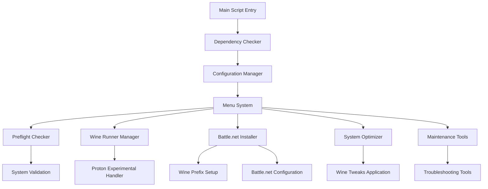

# Design Document

## Overview

The azeroth-winebar is a bash-based helper script that provides a user-friendly interface for installing, configuring, and optimizing World of Warcraft and Battle.net on Linux systems. The design adapts the proven lug-helper architecture while incorporating Battle.net-specific optimizations and Proton Experimental as the default wine runner.

The application follows a modular design with clear separation between user interface, system operations, and game-specific configurations. It supports both GUI (Zenity) and terminal-based interfaces, ensuring accessibility across different Linux environments.

## Architecture

### Core Components



### File Structure

```
azeroth-winebar/
├── azeroth-winebar.sh          # Main script
├── lib/
│   └── wow-launch.sh           # Game launch script
├── icons/
│   └── battlenet-launcher.png  # Battle.net icon
└── README.md                   # Documentation
```

### Configuration Structure

```
~/.config/azeroth-winebar/
├── winedir.conf               # Wine prefix path
├── gamedir.conf              # Game installation path
├── firstrun.conf             # First run flag
└── keybinds/                 # WoW keybind backups
```

## Components and Interfaces

### 1. Main Script (azeroth-winebar.sh)

**Purpose:** Entry point and orchestration of all functionality

**Key Functions:**
- `main()` - Primary menu and flow control
- `getdirs()` - Directory path management and validation
- `menu()` - Generic menu display system
- `message()` - User communication interface

**Interface:**
- Command line arguments for direct function access
- Environment variable configuration
- Exit codes for automation integration

### 2. Dependency Management

**Purpose:** Validate system requirements and dependencies

**Key Functions:**
- `check_dependencies()` - Verify required packages
- `check_wine_version()` - Validate wine compatibility
- `install_missing_deps()` - Guide dependency installation

**Dependencies Checked:**
- bash, coreutils, curl, polkit
- cabextract, unzip (winetricks deps)
- zenity (optional, for GUI)

### 3. Wine Runner Management

**Purpose:** Handle wine runner installation and management with Proton Experimental focus

**Key Functions:**
- `install_runner()` - Download and install wine runners
- `delete_runner()` - Remove installed runners
- `get_proton_experimental()` - Specific Proton Experimental handler
- `set_default_runner()` - Configure default wine runner

**Proton Experimental Integration:**
- Custom download logic for Proton Experimental releases
- Steam compatibility layer configuration
- Proton-specific environment variable setup

### 4. Battle.net Installation System

**Purpose:** Automated Battle.net and WoW installation with optimizations

**Key Functions:**
- `install_battlenet()` - Main installation orchestrator
- `create_wine_prefix()` - Wine prefix initialization
- `apply_wine_tweaks()` - Battle.net-specific wine configuration
- `install_dependencies()` - Required wine components

**Installation Flow:**
1. Create 64-bit wine prefix
2. Install Arial font via winetricks
3. Apply registry tweaks (DXVA2, nvapi overrides)
4. Download and install Battle.net setup
5. Create optimized Battle.net.config
6. Set up launch scripts and desktop entries

### 5. System Optimization

**Purpose:** Apply system-level optimizations for optimal WoW performance

**Key Functions:**
- `preflight_check()` - Comprehensive system validation
- `fix_map_count()` - Set vm.max_map_count
- `fix_file_limits()` - Configure file descriptor limits
- `check_memory()` - Validate memory requirements

**Optimizations Applied:**
- vm.max_map_count ≥ 16777216
- Hard file descriptor limit ≥ 524288
- Memory validation (16GB RAM, 40GB total)

### 6. WoW-Specific Configuration

**Purpose:** Apply World of Warcraft-specific tweaks and optimizations

**Key Functions:**
- `configure_wow_settings()` - Apply Config.wtf tweaks
- `setup_dxvk_config()` - DXVK optimization configuration
- `apply_mouse_fixes()` - Cursor and input optimizations

**WoW Tweaks:**
- worldPreloadNonCritical = 0
- rawMouseEnable = 1
- DXVK shader cache configuration
- Graphics optimization settings

## Data Models

### Configuration Data

```bash
# Wine Configuration
wine_prefix="/path/to/wine/prefix"
wine_runner="proton-experimental"
wine_version="8.0"

# Game Configuration  
game_path="/path/to/wow/installation"
battlenet_path="/path/to/battlenet"
config_wtf_path="/path/to/Config.wtf"

# System Configuration
vm_max_map_count=16777216
file_descriptor_limit=524288
memory_gb=16
```

### Battle.net Configuration Template

```json
{
  "Client": {
    "GameLaunchWindowBehavior": "2",
    "GameSearch": {
      "BackgroundSearch": "true"
    },
    "HardwareAcceleration": "false",
    "Sound": {
      "Enabled": "false"
    },
    "Streaming": {
      "StreamingEnabled": "false"
    }
  }
}
```

### Environment Variables

```bash
# DXVK Configuration
export DXVK_CONFIG_FILE="$GAMEDIR/dxvk.conf"
export DXVK_HUD="compiler"
export DXVK_STATE_CACHE_PATH="$GAMEDIR"

# Wine Configuration
export WINEDLLOVERRIDES="nvapi=disabled;nvapi64=disabled"
export STAGING_SHARED_MEMORY=1

# Graphics Optimization
export __GL_SHADER_DISK_CACHE=1
export __GL_SHADER_DISK_CACHE_PATH="$GAMEDIR"
export __GL_DXVK_OPTIMIZATIONS=1
```

## Error Handling

### Error Categories

1. **System Errors**
   - Missing dependencies
   - Insufficient permissions
   - Hardware limitations

2. **Configuration Errors**
   - Invalid paths
   - Corrupted config files
   - Missing wine prefix

3. **Installation Errors**
   - Download failures
   - Wine installation issues
   - Battle.net setup problems

### Error Handling Strategy

```bash
# Error handling pattern
function_name() {
    local retval=0
    
    # Validation
    if ! validate_preconditions; then
        debug_print exit "Precondition validation failed"
        return 1
    fi
    
    # Main operation with error checking
    if ! perform_operation; then
        debug_print continue "Operation failed, attempting recovery"
        if ! recovery_operation; then
            debug_print exit "Recovery failed, aborting"
            return 1
        fi
    fi
    
    return $retval
}
```

### User Communication

- **Info Messages:** Success confirmations, progress updates
- **Warning Messages:** Non-critical issues, recommendations
- **Error Messages:** Critical failures requiring user action
- **Question Dialogs:** User decisions and confirmations

## Testing Strategy

### Unit Testing Approach

1. **Function Testing**
   - Individual function validation
   - Input/output verification
   - Error condition handling

2. **Integration Testing**
   - Component interaction validation
   - End-to-end workflow testing
   - Configuration persistence testing

3. **System Testing**
   - Multi-distribution compatibility
   - Hardware configuration variations
   - Wine version compatibility

### Test Categories

1. **Dependency Tests**
   - Package availability validation
   - Version requirement checking
   - Missing dependency handling

2. **Installation Tests**
   - Fresh installation workflows
   - Upgrade scenarios
   - Error recovery testing

3. **Configuration Tests**
   - Config file creation/modification
   - Path validation and correction
   - Settings persistence

4. **Wine Integration Tests**
   - Proton Experimental compatibility
   - Wine prefix management
   - Registry modification validation

5. **Game Launch Tests**
   - Battle.net startup verification
   - WoW launch functionality
   - Performance optimization validation

### Testing Environment Requirements

- Multiple Linux distributions (Ubuntu, Fedora, Arch)
- Various desktop environments (GNOME, KDE, XFCE)
- Different hardware configurations (AMD, Nvidia, Intel)
- Wine versions and Proton Experimental builds

### Automated Testing Framework

```bash
#!/bin/bash
# Test runner framework
run_tests() {
    local test_results=()
    
    for test_function in "${test_functions[@]}"; do
        if $test_function; then
            test_results+=("PASS: $test_function")
        else
            test_results+=("FAIL: $test_function")
        fi
    done
    
    # Report results
    generate_test_report "${test_results[@]}"
}
```

This design provides a robust foundation for the azeroth-winebar project, ensuring compatibility with the existing lug-helper architecture while adding the necessary Battle.net and WoW-specific functionality with Proton Experimental as the default wine runner.